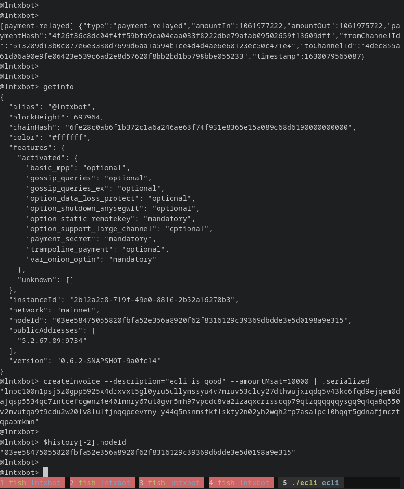

# ecli

An interactive, immersive, CLI for [eclair](https://acinq.github.io/eclair/).



It displays events that happen in your node, allows you to query all the API methods and do [`jq`](https://stedolan.github.io/jq/) queries on them, and provides extra useful methods.

## Install

Download a binary from [Releases](releases), or build with Go:

```
go get github.com/fiatjaf/ecli
```

## Usage

Just run (if you have it in your `$PATH`)

```
ecli
```

It will get the Éclair API credentials from `~/.eclair/eclair.conf`.

If you're trying to access a remote node (for example, from your home to a VPS that is hosting your node) you can create a dummy file there with only the API credentials:

```
eclair {
  node-alias = "myeclair"
  api {
    binding-ip = 10.148.18.18
    port = 8080
    password = "satoshi21"
  }
}
```

## Roadmap

 - [x] Basic API calls
 - [x] `jq` on calls history (`$last | .` -- or just `.`, `$history | map(.)`)
 - [x] Pipe to `jq`: `getinfo | .nodeId`
 - [x] `openfullbalance` command (like `open`, but uses all your balance instead)
 - [x] Websocket events printed on console
 - [ ] Human-readable event formatting
 - [ ] Storeable `jq` flows and custom methods
 - [ ] More data-drilling functions besides `jq`
 - [ ] More extra methods (which ones?)
 - [ ] Initiating `ecli` with a call, like `ecli`

## License

Public domain, except you can't use for shitcoins.
